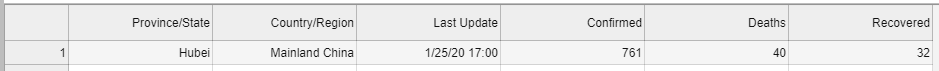
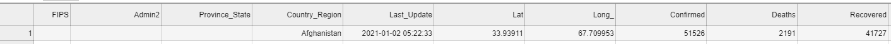
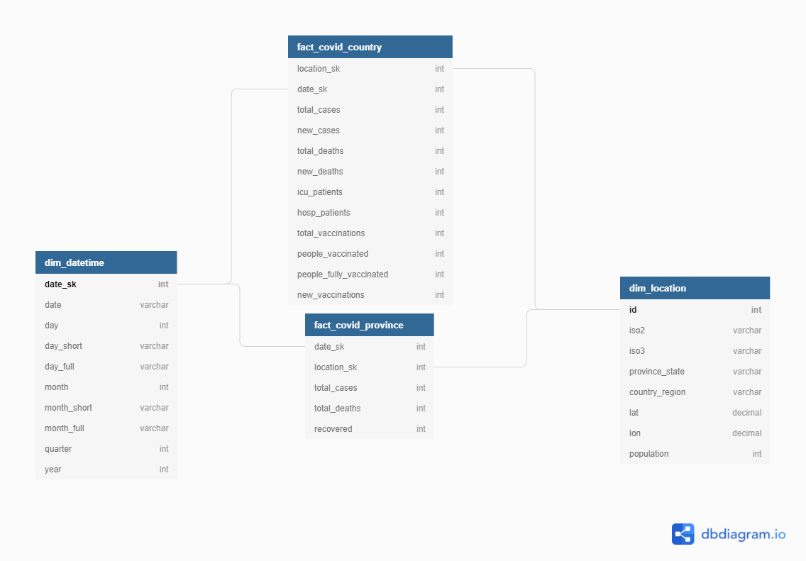

# Covid19_WorldMap
### Data Engineering Capstone Project

#### Project Summary
The project using public covid19 datasets from github to create a data warehouse to help with building reports and analyze covid pandemic. A use case of this is to generate a worldmap represents the spread of covid pandemic, and the progress of vaccine from every country. From that we can identify the center of pandemic and make decision to minimize the damage of it.

The project follows the follow steps:
* Step 1: Scope the Project and Gather Data
* Step 2: Explore and Assess the Data
* Step 3: Define the Data Model
* Step 4: Run ETL to Model the Data
* Step 5: Complete Project Write Up

### Step 1: Scope the Project and Gather Data

#### Scope 
This project gather public covid19 data from github, I try to combine information from 2 repositories to create a single source of truth, a data warehouse that can later be used in report or analytics data.

I will use spark standalone here to process the data, we can easily migrate into running spark on any cloud provider to speed up processing. The following steps will be carried out:

- Exploratory data analysis of data on covid19 by Our World in Data to identify data schema and strategies for data cleaning 
- Exploratory data analysis of covid data at Johns Hopkins University to identify data schema and strategies for data cleaning
- Perform data cleaning on all datasets
- Identify the grain of fact table is by datetime and by location.
- Create datetime and location dimension tables derived from 2 datasets
- Create fact table from 2 datasets and reference to dimension tables.

#### Describe and Gather Data 
Thanks to [Data on COVID-19 (coronavirus) by Our World in Data](https://github.com/owid/covid-19-data/tree/master/public/data) has public covid data daily updated for every country, it include information about vaccine and patients in ICU treament. The data is in csv files with 62 columns, I will not use all columns in this, instead I select some of the columns that I find valuable. I will name it covid_country because its data is at country level. Here is columns description:

|columns|description|
|:--|:--|
|`iso_code`|ISO 3166-1 alpha-3 – three-letter country codes|
|`location`|Geographical location|
|`date`|Date of observation|
|`total_cases`|Total confirmed cases of COVID-19|
|`new_cases`|New confirmed cases of COVID-19|
|`total_deaths`|Total deaths attributed to COVID-19|
|`new_deaths`|New deaths attributed to COVID-19|
|`icu_patients`|Number of COVID-19 patients in intensive care units (ICUs) on a given day|
|`hosp_patients`|Number of COVID-19 patients in hospital on a given day|
|`total_vaccinations`|Total number of COVID-19 vaccination doses administered|
|`people_vaccinated`|Total number of people who received at least one vaccine dose|
|`people_fully_vaccinated`|Total number of people who received all doses prescribed by the vaccination protocol|
|`new_vaccinations`|New COVID-19 vaccination doses administered (only calculated for consecutive days)|

Thanks to [COVID-19 Data Repository by the Center for Systems Science and Engineering (CSSE) at Johns Hopkins University](https://github.com/CSSEGISandData/COVID-19) has public covid19 data detail in province and number of recovered patients. Here is detail information about the data. I will call it covid_province because its data is detail at province level.

|columns|description|
|:--|:--|
|`Province_State`|Province, state or dependency name|
|`Country_Region`|Country, region or sovereignty name. The names of locations included on the Website correspond with the official designations used by the U.S. Department of State|
|`Last_Update`|Has different format in files, we have to format it|
|`Confirmed`|Counts include confirmed and probable (where reported)|
|`Deaths`|Counts include confirmed and probable (where reported)|
|`Recovered`|Recovered cases are estimates based on local media reports, and state and local reporting when available, and therefore may be substantially lower than the true number|

Last but not least is location data, it is used to create location table and reference to location of 2 datasets above, it is the combination of [World Cities Database](https://simplemaps.com/data/world-cities) and [JHU CSSE COVID-19 Dataset](https://github.com/CSSEGISandData/COVID-19/blob/master/csse_covid_19_data/UID_ISO_FIPS_LookUp_Table.csv)
and the location from covid19 datasets but not in 2 location datasets above. Sample location schema from World Cities Database

|columns|description|
|:--|:--|
|`city`|City name|
|`city_ascii`|City name in ascii|
|`lat`|Latitude of location|
|`lon`|Longitude of location|
|`country`|Country, region or sovereignty name|
|`iso2`|iso2 code of location|
|`iso3`|iso3 code of location|
|`admin_name`|The name of the highest level administration region of the city town (e.g. a US state or Canadian province).|
|`population`|Population of location|
|`id`|ID of location|

### Step 2: Explore and Assess the Data
#### Explore the Data 
Data for province and country is duplidate between locations and covid_daily, I will create dim_location table to store location information and reference location uid from dim_location back to covid_province (I will call it fact_covid_province now). For country that has Province_State is null is because that row represent the country average latitude and longitude, and total population of that country, I will replace null with empty province so it will not cause unexpected behaviors when we doing join later.

Covid_country dataframe has some columns with None value (etc: `total_deaths`, `new_deaths`,...). I will replace None with 0 indicate that there are no deaths on that day. It will help us easy to do aggregation later.

After investigate covid_province data, there are mismatch schema between csv files, for example: 

In `./lake/raw_zone/covid_province/01-25-2020.csv` we have this schema: 

In `./lake/raw_zone/covid_province/01-01-2021.csv` we have this schema: 

I will process this schema mismatch in data, merge into one schema to use later. I also handle the mismatch in datetime format between `Last_Update` and `last Update`  columns.

In most data files, `Last Update` is in this format `M/d/yy HH:mm`, but in some files like `./lake/raw_zone/covid_province/03-15-2020.csv` it has format like this `yyyy-MM-ddTHH:mm:ss`

Meanwhile `Last_Update` is different between files, some file is `M/d/yy HH:mm` and some is `yyyy-MM-dd HH:mm:ss`.

#### Cleaning Steps
##### 1. Merge mismatch schema in csv data of covid data detail in provinces
##### 2. Replace null value in covid_country_df by 0, also change data type of integer columns to integer type

### Step 3: Define the Data Model
#### 3.1 Conceptual Data Model
The schema will look like this:

The dim_datetime dimension table is coming from all possible datetime appear in covid_country and covid_province. I prepopulate addition columns that might need in report or analysis in the future, maybe we will want to get day or month in string, or roll up to analyze data in quarter, year.

The dim_location table is populated from raw_locations dataset, it includes iso code of the country, the cordination and population. It allow we design a report for different country, in different day, and visualize that useful information to a worldmap. It bring us the overall picture of covid pandemic in all over the world in an intuitive way. We can also calculate the percent of people who get vaccine of a country, from that we can see how that country is dealing with covid pandemic.

The fact_covid_country table is derived from covid_country datasets, it brings us daily data of a country, it includes the number of total cases, new cases, total deaths,... of covid19. It also includes the number of patients in ICU (intensive care unit), number of people who get vaccine. From that data, we can visualize in report the spread and damage that covid bring to a country.

The fact_covid_province table is coming from covid_province dataset, it drills down the data detail in province level, help us identify the center of pandemic in a country. It also includes the number of recovered patient in province level.

#### 3.2 Mapping Out Data Pipelines
The pipeline steps to get the final schema are as follow:
1. Gather data source from github
2. Load data into spark dataframe
3. Merge mistmatch data in covid_country dataset 
4. Cast data type of columns in covid_country into its correct one, replace null value with appropriate number.
5. Create dim_datetime table derived from time columns in covid_province and covid_country datasets
6. Create dim_location from raw_locations dataset, filter out unnecessary columns
7. Select only valuable columns to create fact_covid_country and fact_covid_province tables, reference datetime and location key to 2 appropriate dimension tables.

### Step 4: Run Pipelines to Model the Data 
#### 4.1 Create the data model
Build the data pipelines to create the data model.

#### 4.2 Data Quality Checks
In order to make sure data quality after cleaning and transforming data in warehouse, I perform some data quality check using pydeequ, an open-source tool developed and used at Amazon to verify data quality of many large datasets. 

There are some actions I run to check the data quality:
- Check uniqueness of key in dimension table
- Check number of records in dim_location after derived from raw_locations
- Check data type of some important table columns 

#### 4.3 Data dictionary 
Create a data dictionary for your data model.

##### fact_covid_country: Table represent data about total cases, deaths and vaccince of the country by day
|columns|description|
|:--|:--|
|`date_sk`|datetime reference to dim_datetime dimension|
|`location_sk`|location reference to dim_location dimension|
|`total_cases`|Total confirmed cases of COVID-19|
|`new_cases`|New confirmed cases of COVID-19|
|`total_deaths`|Total deaths attributed to COVID-19|
|`new_deaths`|New deaths attributed to COVID-19|
|`icu_patients`|Number of COVID-19 patients in intensive care units (ICUs) on a given day|
|`hosp_patients`|Number of COVID-19 patients in hospital on a given day|
|`total_vaccinations`|Total number of COVID-19 vaccination doses administered|
|`people_vaccinated`|Total number of people who received at least one vaccine dose|
|`people_fully_vaccinated`|Total number of people who received all doses prescribed by the vaccination protocol|
|`new_vaccinations`|New COVID-19 vaccination doses administered (only calculated for consecutive days)|

##### fact_covid_province: Table detail in province data about covid19 with recovered case y day
|columns|description|
|:--|:--|
|`date_sk`|datetime reference to dim_datetime dimension|
|`location_sk`|location reference to dim_location dimension|
|`total_cases`|Counts include confirmed and probable (where reported)|
|`total_deaths`|Counts include confirmed and probable (where reported)|
|`recovered`|Recovered cases are estimates based on local media reports, and state and local reporting when available, and therefore may be substantially lower than the true number|

##### dim_location: Table represent all information related to location like iso code, latitude, longitude
|columns|description|
|:--|:--|
|`id`|ID of location|
|`iso2`|iso2 code of location|
|`iso3`|iso3 code of location|
|`Province_State`|Province, state or dependency name|
|`Country_Region`|Country, region or sovereignty name|
|`Lat`|Latitude of location|
|`Lon`|Longitude of location|
|`population`|Population of location|

##### `dim_datetime`: datetime dimension table precalculate some useful information
|column|description|
|:--|:--|
|`date_sk`|datetime key in interger type, with yyyyMMdd format|
|`date`|datetime value in string type, with yyyy-MM-dd format|
|`day`|day of month|
|`day_short`|short string represent day value|
|`day_full`|full string represent day value|
|`month`|month value in integer|
|`month_short`|short string represent month value|
|`month_full`|full string represent month value|
|`quarter`|number of quater in a year|
|`year`|year value|

#### Step 5: Complete Project Write Up
After finished this project, I used the result to generate a covid19 worldmap showed in [covid19.html](./covid19.html)

##### 1. Technologies used in this project

I use mainly is pyspark to clean data, it has ability to handle big data, it can working with many different type of files and it is easy to use. For now it just running standalone. In order to utilize all its power, we can run this project with Spark cluster running distributed on YARN or using databricks platform.

In order to perform checking data quality, I use [pydeequ](https://github.com/awslabs/python-deequ), an open source python wrapper of Deequ (an open-source tool developed and used at Amazon). It is very powerful tool when you want to check data quality on big data.

##### 2. How often the data should be updated

For covid19 datasets, I think it is the best that dataset is updated daily, because it is a resonable time frame to measure all the numbers and events.

##### 3. How you would approach the problem differently under the following scenarios:
* The data was increased by 100x: Spark can easily handle that but with distributed mode and reasonable number of nodes.
* The data populates a dashboard that must be updated on a daily basis by 7am every day: We can use Apache Airflow to schedule the pipeline.
* The database needed to be accessed by 100+ people: We can use Amazon Redshift, it has ability to work with large number of people.
